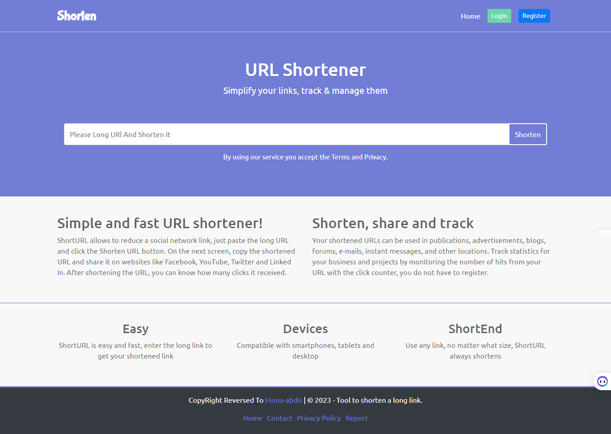

# About The Project
Simple php project framework created by using MVC design pattern

# Requirements
<table>
    <tr>
        <th>PHP</th>
        <th>mona-abdo/framework</th>
    </tr>
    <tr>
        <td>^8.1.3</td>
        <td>1.0.*</td>
    </tr>
</table>

# Install the Project
<pre>composer create-project --prefer-dist mona-abdo/phplite shorten</pre>

